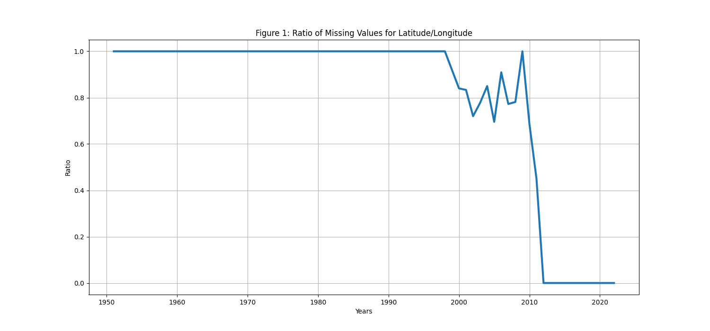

# COMP 4447: Avalanche Fatalities Data

## Introduction
This is a final project for COMP 4447 that demonstrate collecting, manipulating, and cleaning data for further use. 
The scope of the project is to collect relevant data on avalanches and conduct exploratory data analysis.
The initial dataset is limited in features and several entries with missing data. 
To retrieve/create new features, the dataset will be split to create two datasets based on missing values for the features **longitude** (*lon*) and **latitude** (*lat*).
The dataset with **longitude** and **latitude**, additional data will be collected releveant to local and period. 
With these two datasets, the project presents exploratory analysis of the relevant features. 

### Literature Review
- [CAIC Avalanche Accident Statistics](https://avalanche.state.co.us/accidents/statistics-and-reporting)
- [Mt Kalmont - Causes of Avalanche](http://www.sfu.ca/~yla312/IAT%20235/P04_week%2013/what-causes-avalanche.html)

## Data Sources

[Colorado Avalanche Fatalities Data](https://avalanche.state.co.us/sites/default/files/2022-11/Accidents_2022_PUBLIC.xlsx): The data provided is an excel worksheet (*xlsx*) which is a comprehensive dataset of avalanches within the US.  [Reference](https://avalanche.state.co.us/forecasts/help/observation-avalanche)

[USGS Elevation](https://apps.nationalmap.gov/epqs/): An open API that returns the geographic elevation given **longitude** and **latitude**.

[Open-Metro Weather API](https://open-meteo.com/en/docs/): An open API the returns weather data given a **time period**, **longitude**, and **latitude**. 


## Data Collection
The data collection consist of starting with the dataset from [Colorado Avalanche Fatalities Data](https://avalanche.state.co.us/sites/default/files/2022-11/Accidents_2022_PUBLIC.xlsx). 
Since the dataset reaches as far back as the 1950s, there are many missing data within entries and the dataset is limited to a select number of features.
The key features that is utilized for collecting additional information of the entires are **longitude** and **latitude**.
Since there is a significant missing data within features *lat* and *lon*, see figure 1, the project is going to utilize two datasets.
The first dataset is the original from [Colorado Avalanche Fatalities Data](https://avalanche.state.co.us/sites/default/files/2022-11/Accidents_2022_PUBLIC.xlsx), and a second dataset is a subset that has valid **longitude** and **latitude**.
The second dataset is merged with elevation and weather data by passing the relevant fields via API. 



### Getting Avalanche Data
The inital [dataset](https://avalanche.state.co.us/sites/default/files/2022-11/Accidents_2022_PUBLIC.xlsx) is retrived with the **requests** package, and then read-in as a DataFrame. 
Key categoric features are corrected for spelling and/or simplified.
The feature *Date* is converted to **datetime** object.
Create the second dataset, variable name *pdf*, which is a subset of all valid *lat* and *lon*.

```python
# Get data
a_req = requests.get('https://avalanche.state.co.us/sites/default/files/2022-11/Accidents_2022_PUBLIC.xlsx')
df = pd.read_excel(a_req.content)

# Cleaning Data
df = df.replace('SKi','Ski')
df = df.replace(['Mechanised Guide','Motorized Guided client','Mechanized Guide'],'Mechanized Guiding Client')
df[['lon','lat']] = df[['lon','lat']].fillna(0)

# Second dataframe
pdf = df[(df.lat != 0) & (df.lon != 0)]
pdf.reset_index()
```
Though *pdf* has only a third (297 entries) of *df* (956 entries), *pdf* is utilized to gather local elevation and weather data.  

### Getting Elevation
With *pdf*, the *lat* and *lon* can be passed to [USGS Elevation API](https://apps.nationalmap.gov/epqs/) to get the elevation. 
First there a function is created to pass *lat* and *lon* entries to a **requests** to return elevation.

```python
# Function to get elevation from lat and lon
def getEle(elat,elon):
  el_url = r'https://epqs.nationalmap.gov/v1/json?'
  el_pars = {
    'output':'json',
    'x':elon,
    'y':elat,
    'units':'Meters'
  }    
  rtn = requests.get(el_url,el_pars).json()['value']
  return float(rtn)

# iterate over lat and lon
elst = []
for tpl in zip(pdf.lat,pdf.lon):
  lat = tpl[0]
  lon = tpl[1]
  elst.append(getEle(lat,lon))
pdf = pdf.assign(Elevation=elst)
```
### Get Weather Data of Date
The [Open-Metro Weather API](https://open-meteo.com/en/docs/) will return select weather data for the location and date of avalanche. 
The key features added to *pdf* are listed below. 
- *precipitation_sum*: Sum of daily precipitation (including rain, showers and snowfall)
- *windspeed_max*: Maximum wind speed on day
- *apparent_temperature_max*: Maximum daily apparent temperature
- *apparent_temperature_min*: Minimum daily apparent temperature
- *apparent_temperature_avg*: Calculated center between Maximum daily apparent temperature and Minimum daily apparent temperature

By iterating through each row of *pdf*, *lat*, *lon*, and *Date* are passed to the API. 
The returns are pushed onto lists, which are then assigned as a feature in *pdf*.

```python
# Setup empty lists 
w_url = 'https://archive-api.open-meteo.com/v1/archive'
precip = []
wind_max = []
atemp_max = []
atemp_min = []
atemp_avg = []

# Loop through available lat and lon
for i,r in enumerate(pdf.iterrows()):
  w_pars = {
    'timezone':'auto',
    'latitude':r[1].lat,
    'longitude':r[1].lon,
    'start_date':r[1].Date,
    'end_date':r[1].Date,
    'daily':['precipitation_sum','apparent_temperature_max','apparent_temperature_min','windspeed_10m_max'],
  }
  w_dat = requests.get(w_url,params=w_pars).json()['daily']
  precip.append(w_dat['precipitation_sum'][0])
  wind_max.append(w_dat['windspeed_10m_max'][0])
  atemp_max.append(w_dat['apparent_temperature_max'][0])
  atemp_min.append(w_dat['apparent_temperature_min'][0])
  atemp_avg.append((w_dat['apparent_temperature_max'][0]+w_dat['apparent_temperature_min'][0])/2)

# Add new data to pdf
pdf['precipitation_sum'] = precip
pdf['windspeed_max'] = wind_max
pdf['apparent_temperature_max'] = atemp_max
pdf['apparent_temperature_min'] = atemp_min
pdf['apparent_temperature_avg'] = atemp_avg
```

### Get Aggregate Weather Data of Previous Seven Days
Using the same [API](https://open-meteo.com/en/docs/), an additional four features are created to account for the week prior. 
- *precipitation_sum_7d*: Calculated sum of precipitation for the week prior
- *apparent_temperature_max_7d*: Calculated max apparent temperature
- *apparent_temperature_min_7d*: Calculated min apparent temperature
- *apparent_temperature_avg_7d*: Calculated center between *apparent_temperature_max_7d* and *apparent_temperature_min_7d*

The process used is similar to the previous. 

```python 
precip7d = []
atemp_max7d = []
atemp_min7d = []
atemp_avg7d = []
for i,r in enumerate(pdf.iterrows()):
  w_pars = {
    'timezone':'auto',
    'latitude':r[1].lat,
    'longitude':r[1].lon,
    'start_date':str(pd.to_datetime(r[1].Date) - pd.Timedelta(days=7)).split()[0],
    'end_date':r[1].Date,
    'daily':['precipitation_sum','apparent_temperature_max','apparent_temperature_min'],
  }
  w_dat = requests.get(w_url,params=w_pars).json()['daily']
  precip7d.append(sum(w_dat['precipitation_sum']))
  atemp_max7d.append(max(w_dat['apparent_temperature_max']))
  atemp_min7d.append(min(w_dat['apparent_temperature_min']))
  atemp_avg7d.append(mean([(w_dat['apparent_temperature_max'][idx]+w_dat['apparent_temperature_min'][idx])/2 for idx in range(7)]))
pdf['precipitation_sum_7d'] = precip7d
pdf['apparent_temperature_max_7d'] = atemp_max7d
pdf['apparent_temperature_min_7d'] = atemp_min7d
pdf['apparent_temperature_avg_7d'] = atemp_avg7d
```

### Get GeoJson Data
A new dataframe is created to carry [GeoJson](https://geojson.org/) data. 
The json is collected from the [folium](https://github.com/python-visualization/folium) package for geometry of US States. 
This json is read into a dataframe and merged with *pdf* to create the new dataframe *gdf*. 

```python
geo_us = gpd.read_file('https://raw.githubusercontent.com/python-visualization/folium/main/tests/us-states.json')
gdf = pd.merge(pdf,geo_us,left_on='State',right_on='id',how='left')
```