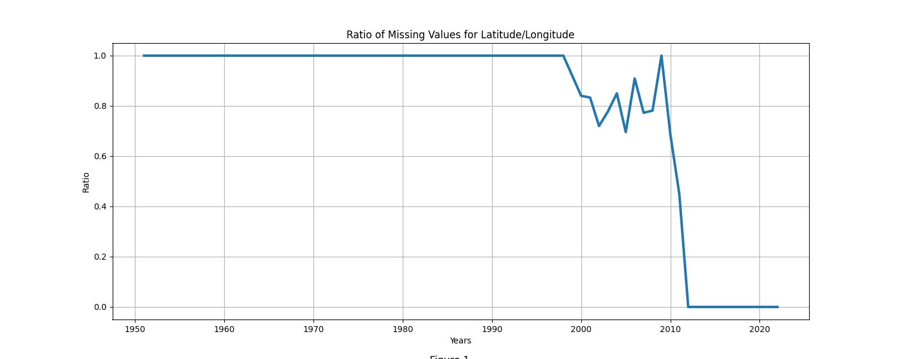

# COMP 4447: Avalanche Data

## Introduction
This is a final project for COMP 4447 that demonstrate collecting, manipulating, and cleaning data for further use. 
The scope of the project is to collect relevant data on avalanches and conduct exploratory data analysis.
The initial dataset is limited in features and several entries with missing data. 
To retrieve/create new features, the dataset will be split to create two datasets based on missing values for the features **longitude** (*lon*) and **latitude** (*lat*).
The dataset with **longitude** and **latitude**, additional data will be collected releveant to local and period. 
With these two datasets, the project presents exploratory analysis of the relevant features. 

## Data Sources

[Colorado Avalanche Fatalities Data](https://avalanche.state.co.us/sites/default/files/2022-11/Accidents_2022_PUBLIC.xlsx): The data provided is an excel worksheet (*xlsx*) which is a comprehensive dataset of avalanches within the US. 

[USGS Elevation](https://apps.nationalmap.gov/epqs/): An open API that returns the geographic elevation given **longitude** and **latitude**.

[Open-Metro Weather API](https://open-meteo.com/en/docs/): An open API the returns weather data given a **time period**, **longitude**, and **latitude**. 

## Data Collection
The data collection consist of starting with the dataset from [Colorado Avalanche Fatalities Data](https://avalanche.state.co.us/sites/default/files/2022-11/Accidents_2022_PUBLIC.xlsx). 
Since the dataset reaches as far back as the 1950s, there are many missing data within entries and the dataset is limited to a select number of features.
The key features that is utilized for collecting additional information of the entires are **longitude** and **latitude**.
Since there is a significant missing data within features *lat* and *lon*, see figure 1, the project is going to utilize two datasets.
The first dataset is the original from [Colorado Avalanche Fatalities Data](https://avalanche.state.co.us/sites/default/files/2022-11/Accidents_2022_PUBLIC.xlsx), and a second dataset is a subset that has valid **longitude** and **latitude**.
The second dataset is merged with elevation and weather data by passing the relevant fields via API. 

### Getting Avalanche Data
The inital dataset is retrived with the **requests** package, and then read-in as a DataFreame. 
Key categoric features are corrected for spelling and/or simplified.
 
https://github.com/IMadeThisAccountForSchool/avalanche4447/blame/fa27794bf67596260adf82bcc80dfb93b3b3edb2/data/proj_4447.py#L12-L19

- code
- output
- etc

## Exploratory Data Analysis

## Conclusion

- Goal
- Approach
- Code/How-To
- Plots
- Conclusion